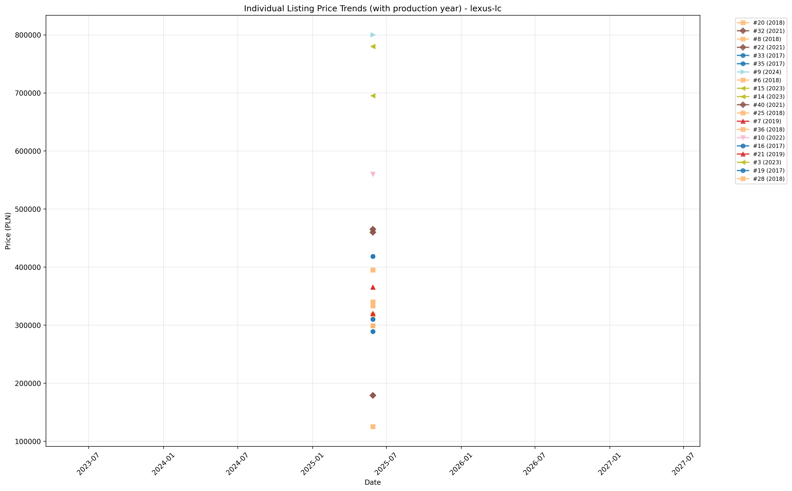
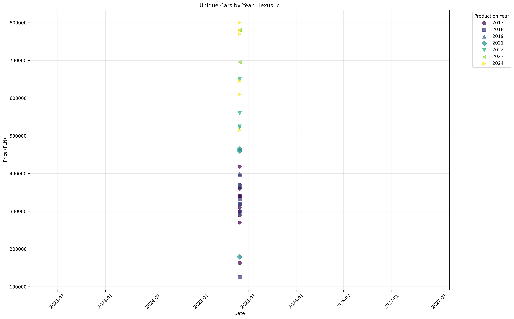

# 📊 Car Scraper Analysis Graphs

This document contains all the automatically generated visualization graphs from the car scraper project. These graphs are updated daily by the GitHub Actions workflow.

## 📈 Latest Analysis Report

**Last Updated**: Automatically updated by GitHub Actions  
**Data Source**: Otomoto.pl car listings  
**Current Model**: Lexus LC  

---

## 🔍 Individual Listings Analysis

### Price Trends Over Time
Track how individual car listings change in price over time, helping identify market patterns and seller behavior.

### Enhanced Individual Trends
Advanced analysis of individual listings with additional trend indicators and statistical overlays.

---

## 📅 Year-Based Analysis

### Listings Distribution by Manufacturing Year
Understand the market composition based on vehicle manufacturing years.

### Comprehensive Year Analysis
Detailed breakdown of price distributions, mileage patterns, and market availability by year.

---

## 💰 Price vs Performance Analysis

### Price vs Mileage Correlation
Analyze the relationship between vehicle mileage and asking price to identify market value patterns.

---

## 📊 Graph Descriptions

### 🔍 Individual Listings Trends
- **Purpose**: Track price changes for specific vehicles over time
- **Insights**: Identify price drops, market adjustments, and seller strategies
- **Key Metrics**: Price evolution, listing duration, price volatility

### 📅 Year Analysis
- **Purpose**: Compare market segments by manufacturing year
- **Insights**: Depreciation patterns, popular model years, age-based pricing
- **Key Metrics**: Average prices by year, listing counts, price ranges

### 💰 Price vs Mileage
- **Purpose**: Understand value depreciation based on usage
- **Insights**: Mileage impact on pricing, value retention patterns
- **Key Metrics**: Correlation coefficients, price per kilometer trends

---

## 🤖 Automated Updates

These graphs are automatically generated and updated by our GitHub Actions workflow:

1. **Daily Scraping**: Fresh data collected every day at 6:00 AM UTC
2. **Automatic Analysis**: All graphs regenerated with latest data
3. **Version Control**: Changes tracked and committed automatically
4. **Data Integrity**: Consistent formatting and quality checks

---

## 📊 Understanding the Data

### Data Sources
- **Primary**: Otomoto.pl (Polish automotive marketplace)
- **Frequency**: Daily automated collection
- **Coverage**: Complete listing details including price, mileage, year, features

### Analysis Methods
- **Time Series**: Price evolution tracking over multiple collection periods
- **Statistical**: Correlation analysis, distribution studies, trend identification
- **Visual**: Color-coded insights, trend lines, statistical overlays

### Graph Types
- **Line Charts**: Time-based trends and evolution
- **Scatter Plots**: Correlation and relationship analysis  
- **Bar Charts**: Distribution and categorical comparisons
- **Heatmaps**: Density and concentration patterns

---

## 🔄 Data Freshness

| Metric | Status |
|--------|--------|
| Last Scrape |  |
| Data Points | Check latest commit for count |
| Models Tracked | Lexus LC (expandable) |
| Update Frequency | Daily at 6:00 AM UTC |

---

## 📈 Market Insights

*This section will be automatically populated with insights as more data is collected over time.*

### Current Observations
- Market trends and patterns will emerge as data accumulates
- Price volatility and seasonality effects
- Popular configuration and feature preferences
- Geographic distribution patterns (if applicable)

### Historical Trends
- Long-term depreciation curves
- Market demand fluctuations
- Seasonal price variations
- Feature popularity evolution

---

*Generated automatically by the Car Scraper project. For technical details, see the [main README](README.md).*
