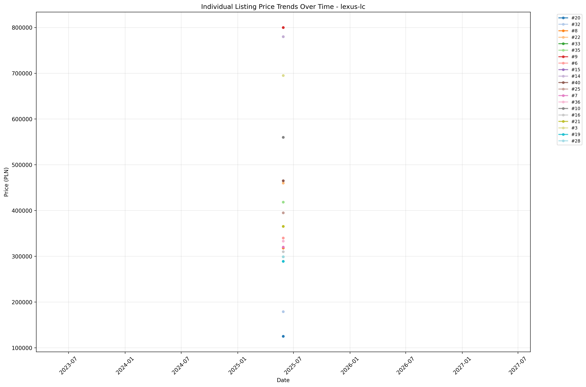
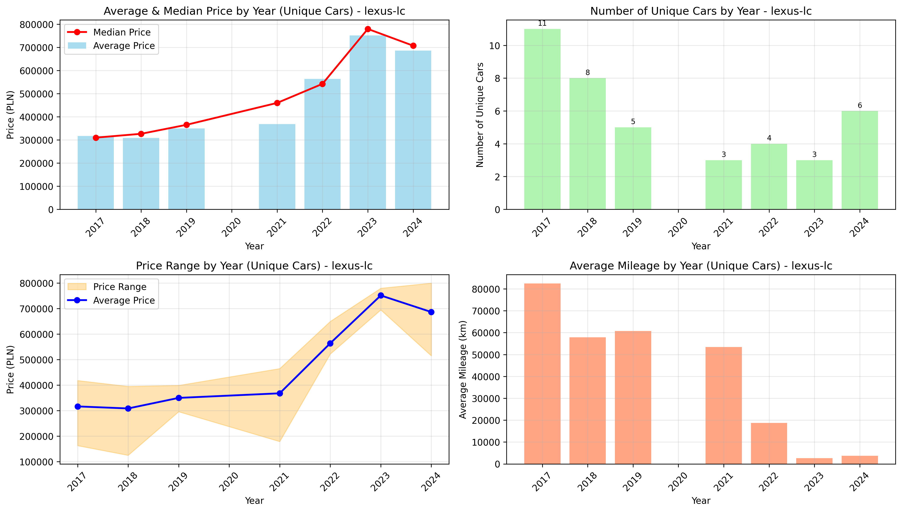
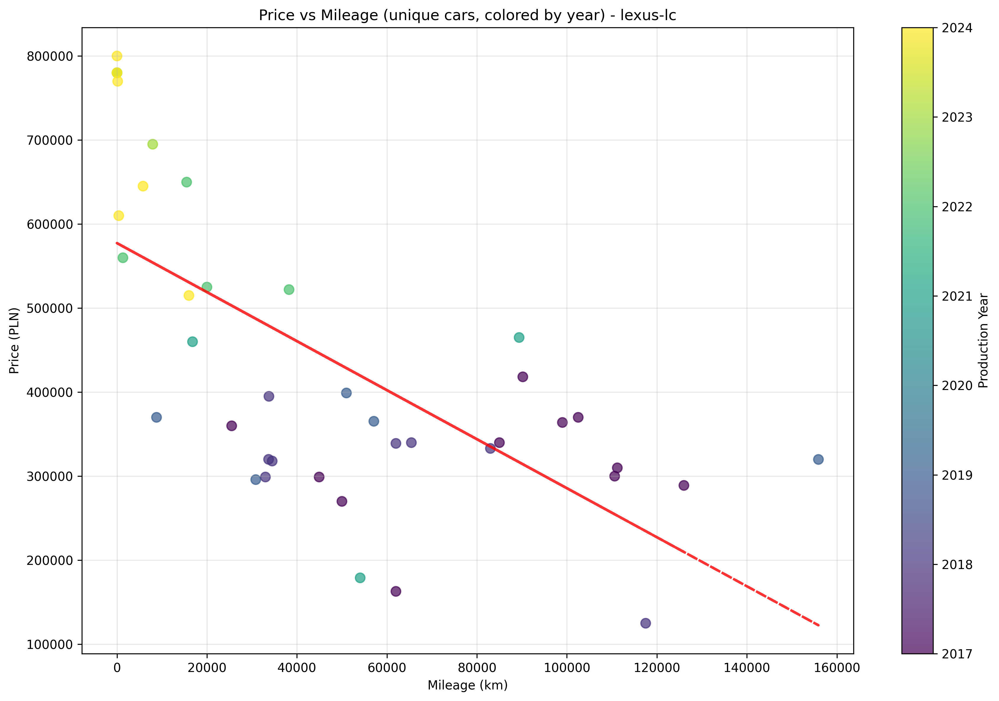

# 🚗 Car Scraper for Otomoto.pl

[](https://github.com/simonloach/car-scraper/actions/workflows/daily-scrape.yml)
[](https://www.python.org/downloads/)
[](https://python-poetry.org/)
[](https://github.com/psf/black)

A modern, professional CLI application for scraping car listings from otomoto.pl with comprehensive time series tracking, analysis, and visualization capabilities.

## ✨ Features

- **Advanced Scraping**: Extract car listings with prices, specifications, and metadata
- **Time Series Tracking**: Monitor individual listings over time for price analysis
- **Rich Visualizations**: Generate comprehensive plots and analysis charts
- **Multiple Data Formats**: Support for both CSV and JSON data formats
- **Professional CLI**: Modern Click-based command-line interface
- **Modular Architecture**: Clean, maintainable codebase following PEP standards
- **Type Safety**: Full type hints with Pydantic data validation
- **Quality Tooling**: Black, isort, mypy, and pytest integration
- **Docker Support**: Containerized deployment ready
- **GitHub Actions**: Automated daily scraping and reporting

## 📊 Live Analysis & Graphs

🔥 **[View Live Analysis Graphs →](GRAPHS.md)** 

Our automated system generates comprehensive visualizations updated daily:

| Graph Type | Description | Latest |
|------------|-------------|---------|
| 🔍 **Individual Trends** | Track price changes for specific vehicles over time |  |
| 📅 **Year Analysis** | Market composition by manufacturing year |  |
| 💰 **Price vs Mileage** | Value correlation and depreciation patterns |  |

*All graphs are automatically updated daily via GitHub Actions. [→ See full analysis report](GRAPHS.md)*

## 🚀 Installation

### Poetry (Recommended)

1. **Install dependencies**:
```bash
poetry install
```

2. **Activate virtual environment**:
```bash
poetry shell
```

3. **Use the CLI**:
```bash
car-scraper --help
```

### Pip Installation

1. **Install in development mode**:
```bash
pip install -e .
```

2. **Use the CLI**:
```bash
car-scraper --help
```

### Docker

1. **Build the Docker image**:
```bash
docker build -t car-scraper .
```

2. **Run with Docker**:
```bash
docker run -v $(pwd)/data:/app/data car-scraper --help
```

## 📖 Usage

### Quick Start

```bash
# Scrape Lexus LC models (2 pages)
car-scraper scrape --url "https://www.otomoto.pl/osobowe/lexus/lc" --model "lexus-lc" --max-pages 2

# Generate all plots
car-scraper plot --model "lexus-lc" --plot-type "all"

# Check data status
car-scraper status
```

### Available Commands

#### 🔍 Scraping

```bash
# Basic scraping
car-scraper scrape --url "https://www.otomoto.pl/osobowe/lexus/lc" --model "lexus-lc"

# Advanced scraping with options
car-scraper scrape \
    --url "https://www.otomoto.pl/osobowe/lexus/lc" \
    --model "lexus-lc" \
    --max-pages 5 \
    --delay 2.0 \
    --format json
```

#### 📊 Plotting

```bash
# Generate all plots
car-scraper plot --model "lexus-lc" --plot-type "all"

# Generate specific plot types
car-scraper plot --model "lexus-lc" --plot-type "individual"  # Price trends
car-scraper plot --model "lexus-lc" --plot-type "year"       # Year analysis
car-scraper plot --model "lexus-lc" --plot-type "legacy"     # Legacy formats
```

#### 📋 Status & Analysis

```bash
# Check data status
car-scraper status

# Run demo workflow
car-scraper demo
```

## 🏗️ Project Structure

```
car-scraper/
├── src/car_scraper/           # Main package
│   ├── models/                # Pydantic data models
│   ├── scrapers/              # Web scraping modules
│   ├── storage/               # Data persistence
│   ├── plotters/              # Visualization modules
│   └── utils/                 # Utilities and helpers
├── data/                      # Scraped data storage
│   ├── *.csv, *.json         # Raw listings data
│   ├── individual_listings/   # Price tracking data
│   ├── plots/                 # Generated visualizations
│   └── time_series/           # Historical data
├── tests/                     # Test suite
├── .github/workflows/         # GitHub Actions
└── main.py                    # CLI entry point
```

## 🤖 Automated Scraping with GitHub Actions

This project includes a powerful GitHub Action that automatically scrapes car listings daily and generates reports.

### Features

- **🕕 Daily Scheduling**: Runs automatically at 6:00 AM UTC (8:00 AM CEST)
- **🎯 Manual Triggers**: Can be triggered manually with custom parameters
- **🔄 Multi-Model Support**: Scrapes multiple car models in one run
- **📊 Automatic Analysis**: Generates plots and visualizations
- **📝 Status Reports**: Creates detailed scraping reports
- **🚀 Auto-Commit**: Pushes results back to the repository

### Supported Models

The action includes pre-configured URLs for popular models:
- `lexus-lc` - Lexus LC
- `bmw-i8` - BMW i8  
- `audi-r8` - Audi R8
- `porsche-911` - Porsche 911

### Manual Execution

You can manually trigger the action with custom parameters:

1. Go to the **Actions** tab in your GitHub repository
2. Select **"🚗 Daily Car Scraper"** workflow
3. Click **"Run workflow"**
4. Optionally customize:
   - **Models**: Comma-separated list (e.g., `lexus-lc,bmw-i8`)
   - **Max Pages**: Number of pages to scrape per model (default: 5)

### Workflow Output

The action generates:
- **📊 Updated Data Files**: Fresh CSV/JSON data for each model
- **📈 Visualization Plots**: Comprehensive analysis charts
- **📋 Status Report**: Detailed scraping summary in `data/status_report.md`
- **🎯 Workflow Summary**: Quick overview in the GitHub Actions interface

### Data Persistence

All scraped data is automatically committed back to the repository with descriptive commit messages including:
- Timestamp of the scraping run
- Total number of listings scraped
- Models processed
- Generated plots and analysis

## 💻 Local Development

### Setting Up Development Environment

```bash
# Install development dependencies
poetry install --with dev

# Install pre-commit hooks
poetry run pre-commit install

# Run tests
poetry run pytest

# Run type checking
poetry run mypy src/

# Format code
poetry run black src/
poetry run isort src/
```

## 📊 CLI Command Reference

### 🔍 `scrape` - Extract Car Listings

```bash
car-scraper scrape [OPTIONS]
```

**Options:**
- `--url TEXT` - Search URL from otomoto.pl (required)
- `--model TEXT` - Model name to save data as (required)  
- `--data-dir TEXT` - Directory to save data (default: ./data)
- `--max-pages INTEGER` - Maximum number of pages to scrape (default: 10)
- `--format [csv|json]` - Output format (default: csv)
- `--delay FLOAT` - Delay between requests in seconds (default: 1.0)

**Examples:**
```bash
# Basic scraping
car-scraper scrape --url "https://www.otomoto.pl/osobowe/lexus/lc" --model "lexus-lc"

# Advanced options
car-scraper scrape \
  --url "https://www.otomoto.pl/osobowe/bmw/i8" \
  --model "bmw-i8" \
  --max-pages 3 \
  --delay 2.0 \
  --format json
```

### 📊 `plot` - Generate Visualizations

```bash
car-scraper plot [OPTIONS]
```

**Options:**
- `--model TEXT` - Model name to generate plots for (required)
- `--data-dir TEXT` - Directory containing data (default: ./data)
- `--plot-type [all|individual|year|legacy]` - Type of plots to generate (default: all)
- `--output-dir TEXT` - Directory to save plots (default: ./plots)

**Plot Types:**
- `individual` - Individual listing price trends over time
- `year` - Year-based analysis (price vs year, mileage analysis)
- `legacy` - Legacy plot formats for historical compatibility
- `all` - Generate all plot types

**Examples:**
```bash
# Generate all plots
car-scraper plot --model "lexus-lc"

# Generate specific plot type
car-scraper plot --model "lexus-lc" --plot-type "year"
```

### 📋 `status` - Data Status Report

```bash
car-scraper status [OPTIONS]
```

**Options:**
- `--data-dir TEXT` - Directory containing data (default: ./data)

**Output:**
- Models found and record counts
- File sizes and last update times  
- Data directory structure overview

### 🎪 `demo` - Full Demo Workflow

```bash
car-scraper demo [OPTIONS]
```

**Options:**
- `--data-dir TEXT` - Directory containing data (default: ./data)

Runs a complete demonstration including data analysis and visualization.

## 📁 Data Structure

### Raw Data Files
```
data/
├── {model}.csv           # Raw scraped listings (CSV format)
├── {model}.json          # Raw scraped listings (JSON format)
├── individual_listings/  # Price tracking data
│   ├── id_mapping.json   # Internal ID mappings
│   └── listings_history.csv # Historical price changes
├── time_series/          # Time series data (future enhancement)
└── plots/                # Generated visualizations
    ├── individual_listings_trends_{model}.png
    ├── year_analysis_{model}.png
    ├── listings_by_year_{model}.png
    └── price_vs_mileage_{model}.png
```

### Data Fields

Each scraped listing contains:
- `id` - Unique listing identifier from otomoto.pl
- `title` - Car title/description
- `price` - Price in PLN (Polish Złoty)
- `year` - Manufacturing year
- `mileage` - Mileage in kilometers (optional)
- `url` - Direct link to the listing
- `model` - Model name (as specified during scraping)
- `scrape_date` - Date of scraping (YYYY-MM-DD)
- `scrape_timestamp` - Unix timestamp of scraping

## 🛠️ Technical Details

### Architecture

- **Modular Design**: Separated concerns (scraping, storage, plotting, utilities)
- **Type Safety**: Full type hints with Pydantic validation
- **Error Handling**: Comprehensive error handling and logging
- **Async Support**: Built for future async/concurrent scraping
- **Extensible**: Easy to add new car models and data sources

### Technologies

- **Python 3.10+** - Modern Python with type hints
- **Poetry** - Dependency management and packaging
- **Click** - Command-line interface framework
- **Pydantic** - Data validation and settings management
- **BeautifulSoup4** - HTML parsing and web scraping
- **Pandas** - Data manipulation and analysis
- **Matplotlib** - Data visualization and plotting
- **Loguru** - Structured logging
- **HTTPX** - HTTP client for web requests

### Quality Assurance

- **Black** - Code formatting
- **isort** - Import sorting
- **MyPy** - Static type checking
- **Pytest** - Test framework
- **Flake8** - Code linting

## 🤝 Contributing

1. **Fork the repository**
2. **Create a feature branch**: `git checkout -b feature/amazing-feature`
3. **Install dependencies**: `poetry install --with dev`
4. **Make your changes** with proper type hints and tests
5. **Run quality checks**:
   ```bash
   poetry run black src/
   poetry run isort src/
   poetry run mypy src/
   poetry run pytest
   ```
6. **Commit your changes**: `git commit -m 'Add amazing feature'`
7. **Push to the branch**: `git push origin feature/amazing-feature`
8. **Open a Pull Request**

## 📄 License

This project is licensed under the MIT License. See LICENSE file for details.

## ⚠️ Disclaimer

This tool is for educational and research purposes. Please respect otomoto.pl's robots.txt and terms of service. Use reasonable delays between requests and avoid overwhelming their servers.

## 🐛 Issues & Support

If you encounter any issues or have suggestions for improvements:

1. Check the [Issues](../../issues) page for existing reports
2. Create a new issue with detailed information:
   - Python version
   - Operating system
   - Error messages or unexpected behavior
   - Steps to reproduce

## 🚀 Future Enhancements

- [ ] Additional car websites support
- [ ] Real-time price alerts
- [ ] Advanced filtering options
- [ ] Web dashboard interface
- [ ] Machine learning price predictions
- [ ] Database storage backend
- [ ] API endpoints for data access